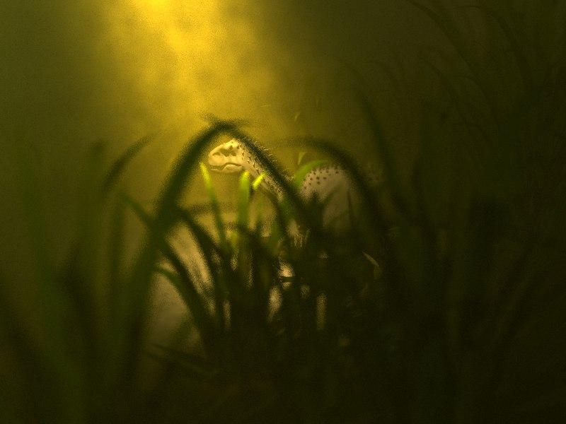
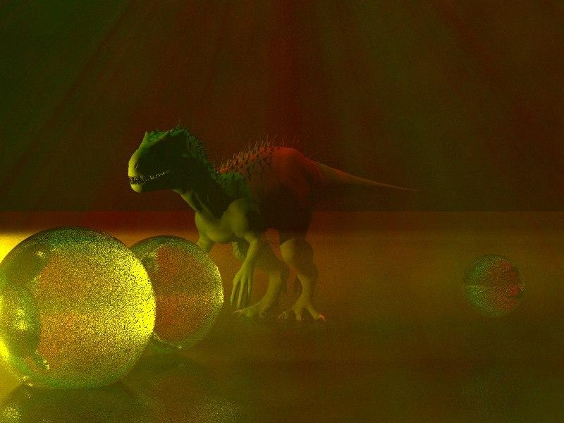
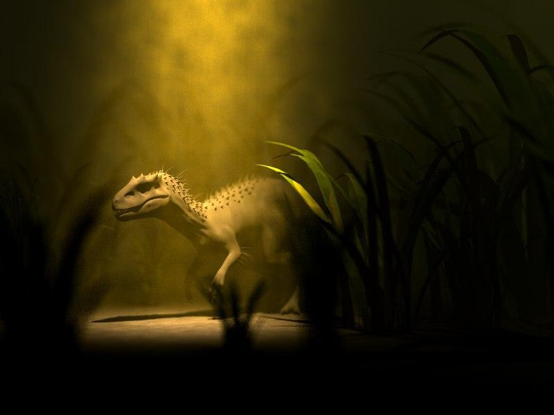
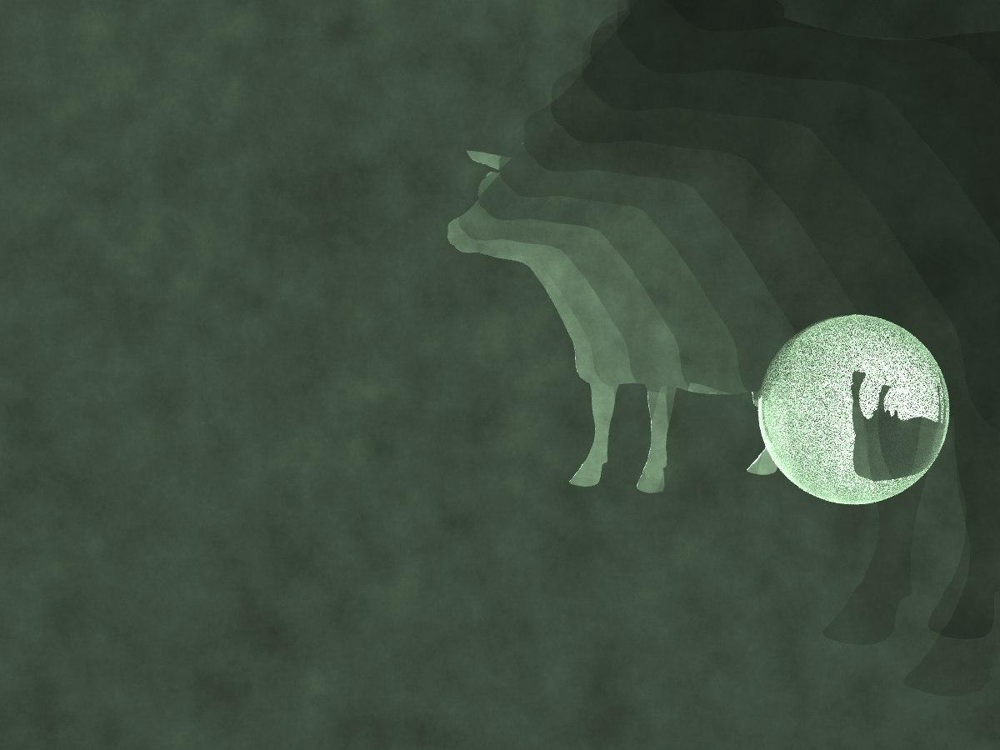
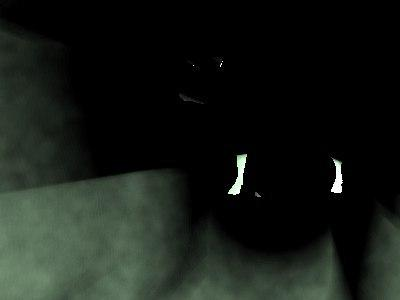
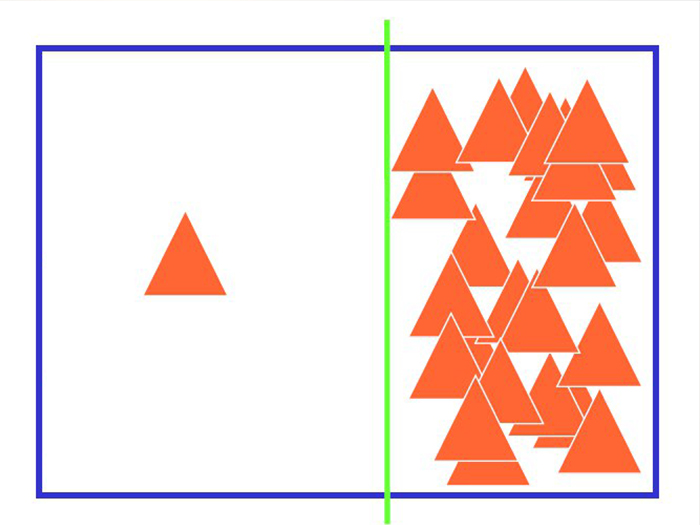
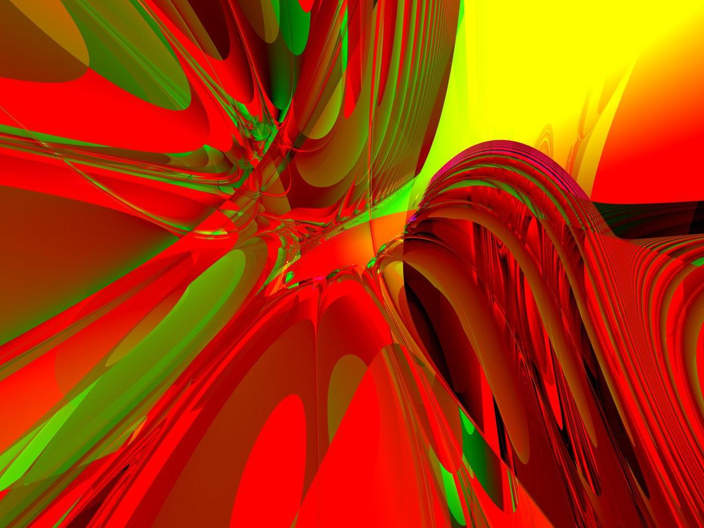

# Watch your back!

> Matthias Flotho and Matthis Kruse

#### 1. Concept Summary

We wanted to get some kind of realism into our image. After watching "Jurassic Park" together, it struck us: Make a scene with a dinosaur that scares anyone looking at it. Thus, we first fiddled around with the placement of the camera with respect to the dinosaur model. This was harder than we thought, as Blender, a free modeling software, uses a different coordinate system than our raytracer. To this point in time, we still have not figured out in detail how one could translate a blender scene into a "Our-Raytracer-Scene", something with swapping y and z and taking z to the negative. - Whatever, after doing literally nothing in Blender besides rotating the model, we, finally, fiddled around with the camera to make the actual viewing angle engaging. We simply added some grass and fog, to arrive at our final idea: A dark swamp-atmosphere where one sees the dinosaur in a poison-yellow-ish rain-fog. To further enhance the swamp-like atmosphere, a ground consisting of water was added. It has a mirror material and a water-ish looking bump map.

#### 2. Building the Scene

The scene was composed with several models from [turbosquid](https://www.turbosquid.com) and free textures found by a popular website search engine. With the help of the CIP-Pool machines, we simply rendered the image very often in low quality and changed parameters a bit, then rendered them again. This endless cycle has led us to what we have now.
All in all, the scene consists of the following components:

- Several `ImageTexture`s
- `MirrorMaterial`, `LambertianMaterial`, `CookTorranceMaterial`, `CombineMaterial`
- Several `BumpMap`ppers
- The dino-model and a veils-model
- A sphere (the raptors red eye)
- A `DOFPerspectiveCamera` model
- A `PerlinSpotLight` and a `SpotLight`

However, the head of the dinosaur had to be tilted by hand. This was rather difficult. Matthis added a animation-skeleton by hand into the raptor model to tilt the head to the camera. This step had to be done, as we, unfortunately, don't own a license of the Maya software, for which the model was intended.

----

A few other images of essentially the same scene, but with different fog, sampling or camera parameters:

----

#### 3. Image Highlights

The volume rendering can gracefully be seen in the fog to the right. The ray marching algorithm (implemented by Matthias) chooses a random step width. The fog gets better the more samples are done while still being reasonably fast. If the chosen step size is too large, one might see an interesting side-effect:

----

The eye of the raptor is red and he looks into the camera.

----

The shadow of the raptor's head can be seen in the fog. This is a terrific effect which can yield to very interesting results. The idea to use the dinosaur itself to cast shadows in the fog arised from the volume rendering bonus exercise. After playing around a bit, we saw the following picture:

Now, you surely understand why we just had to utilize this somehow.

-----

The veins at the bottom of the image look motion-blurred. (note that, even though we've implemented the motion blur effect, it's just the DOF-Camera model in this case)

------

The skin is bump mapped, which can be seen easily by changing the perspective. Also, one sees from this perspective that the dinosaur appears wet by "tropical rain". This is effect done by combining a Cook-Torrance and a Lambertian material. The following image was rendered without volume rendering.

----

The floor of the scene was also bump mapped with a simple water bumpmap, which led the scene seem like an Jurassic era swamp. This was rather easy to implement with Matthias' new [`PlaneBumpMapper`](https://git.cg.uni-saarland.de/course-cg1-2018/groupA/src/commit/367fa2c0d1fd3ea2af18849e20f9417a6ad380ff/rt/primmod/bmap.h#L14).

----

To speed up the rendering process, Matthis implemented surfaced area heuristic as covered in the lecture. Also, the BVH tree is flattened. The implementation is at [`rt/groups/bvhbuilder.cpp`](https://git.cg.uni-saarland.de/course-cg1-2018/groupA/src/commit/36120d8997e31d2cc8bb4e01a4425cd855f5c003/rt/groups/bvhbuilder.cpp#L181).
To benchmark the spatial indexing structure, the well known "Lucy"-model from the Stanford 3D scans repository was taken. It has 448868 faces and was placed into the scene with a Cook-Torrance material exactly two times. A 6400x3600 image took 20721ms, incluiding the BVH-build. However, reducing the image size to 640x360 makes it render in just 259ms! (run on a crappy Lenovo Thinkpad X220)
4

#### 4. Feature Additions

Volume rendering was implemented by Matthis, however, Matthias has written a hacky integrator that combines material sampling and volume rendering. This can be seen in [`rt/integrators/recraymarching.cpp:20`](https://git.cg.uni-saarland.de/course-cg1-2018/groupA/src/commit/0301ce938af3b04326f55bc93e7d12613f893de9/rt/integrators/recraymarching.cpp#L20).  The renderer was enhanced by Matthis to support an arbitrary amount of cores. This has led to a rather efficient  rendering loop that is faster than an OpenMP-pragma.  (Custom `143260ms` **vs** `180812ms` OpenMP)  You can find it at [`rt/renderer.cpp:95`](https://git.cg.uni-saarland.de/course-cg1-2018/groupA/src/commit/0301ce938af3b04326f55bc93e7d12613f893de9/rt/renderer.cpp#L95). Furthermore, an additional light source was added by Matthias to simulate the effects of fog in a cheap way. This was done by simply adding some perlin noise. See [`rt/lights/perlinspotlight.cpp:1`](https://git.cg.uni-saarland.de/course-cg1-2018/groupA/src/commit/0301ce938af3b04326f55bc93e7d12613f893de9/rt/lights/perlinspotlight.cpp#L1). Lastly, Matthias added bump mapping for infinite planes, which is simply added to [`rt/primmod/bmap.cpp:15`](https://git.cg.uni-saarland.de/course-cg1-2018/groupA/src/commit/ba402ace4f6235a5013a64be0447e3b9c9d71e3e/rt/primmod/bmap.cpp#L15).

#### 5. Conclusion

The image should win the competition, because, I mean look at it, it's a f`**`king dinosaur!

### References

- [Dinosaur model](https://www.turbosquid.com/FullPreview/Index.cfm/ID/1182227)
- [Veil model](https://free3d.com/3d-model/high-quality-grass-78178.html)
- [Lucy](http://graphics.stanford.edu/data/3Dscanrep/)

-------

--------

----

#### Projective Light Source FUN

